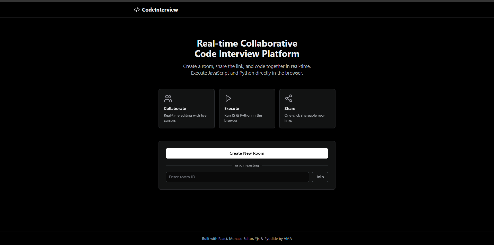

# Code Interview Platform

A real-time collaborative code interview platform with in-browser code execution.

Link [https://ai-dev-tools-zoomcamp-2025-production.up.railway.app/](https://codeview.ama24.my/)



## Features

- ✅ **Shareable room links** - Create a room and share the URL
- ✅ **Real-time collaboration** - Multiple users can edit the same code simultaneously
- ✅ **Live cursors & presence** - See who's connected and where they're editing
- ✅ **Syntax highlighting** - Monaco Editor (VS Code's editor) with multiple languages
- ✅ **In-browser code execution**:
  - JavaScript - Sandboxed iframe execution
  - Python - Pyodide (WebAssembly) runtime
- ✅ **Dark theme** - Clean, modern black & white UI

## Tech Stack

| Component | Technology |
|-----------|------------|
| Frontend | React + Vite |
| Editor | Monaco Editor |
| Real-time sync | Yjs + y-websocket |
| Styling | Tailwind CSS |
| Backend | Node.js + Express |
| JS Execution | Sandboxed iframe |
| Python Execution | Pyodide (WebAssembly) |

## Architecture

```
┌─────────────────────────────────────────────────────────┐
│                        Client                           │
│  ┌─────────────┐  ┌─────────────┐  ┌─────────────────┐ │
│  │   React     │  │   Monaco    │  │    Code Runner  │ │
│  │   Router    │  │   Editor    │  │  (iframe/WASM)  │ │
│  └─────────────┘  └──────┬──────┘  └─────────────────┘ │
│                          │                              │
│                    ┌─────┴─────┐                        │
│                    │    Yjs    │                        │
│                    │   CRDT    │                        │
│                    └─────┬─────┘                        │
└──────────────────────────┼──────────────────────────────┘
                           │ WebSocket
┌──────────────────────────┼──────────────────────────────┐
│                     Server                              │
│  ┌─────────────┐  ┌─────┴─────┐                        │
│  │   Express   │  │ y-websocket│                        │
│  │     API     │  │   Server   │                        │
│  └─────────────┘  └───────────┘                        │
└─────────────────────────────────────────────────────────┘
```

## Getting Started

### Prerequisites

- Node.js 18+ 
- npm or yarn

### Installation

1. **Clone the repository:**
   ```bash
   cd homework-02-end-to-end
   ```

2. **Install all dependencies:**
   ```bash
   # Install root dependencies
   npm install

   # Install backend dependencies
   cd backend && npm install

   # Install frontend dependencies
   cd ../frontend && npm install
   ```

3. **Start the development servers:**

   In one terminal, start the backend:
   ```bash
   cd backend
   npm run dev
   ```

   In another terminal, start the frontend:
   ```bash
   cd frontend
   npm run dev
   ```

4. **Open in browser:**
   - Frontend: http://localhost:5173
   - Backend API: http://localhost:3001

### Usage

1. Click **"Create New Room"** on the home page
2. Share the room URL with others
3. Start coding together in real-time!
4. Click **"Run"** to execute JavaScript or Python code

## Project Structure

```
homework-02-end-to-end/
├── frontend/               # React frontend
│   ├── src/
│   │   ├── pages/
│   │   │   ├── Home.jsx    # Landing page
│   │   │   └── Room.jsx    # Code editor room
│   │   ├── App.jsx         # Router setup
│   │   ├── main.jsx        # Entry point
│   │   └── index.css       # Tailwind styles
│   ├── package.json
│   └── vite.config.js
│
├── backend/                # Node.js backend
│   ├── index.js            # Express server + WebSocket
│   ├── yjs-server.js       # Yjs document sync
│   └── package.json
│
├── package.json            # Monorepo config
└── README.md
```

## Security

### JavaScript Execution
- Runs in a **sandboxed iframe** with `sandbox="allow-scripts"` only
- No access to parent DOM, cookies, or localStorage
- 5-second timeout for infinite loop protection

### Python Execution
- Runs in **Pyodide** (WebAssembly) - no server-side execution
- Isolated from the main page context
- Memory-limited by browser WASM constraints

## API Endpoints

| Method | Endpoint | Description |
|--------|----------|-------------|
| POST | `/api/rooms` | Create a new room |
| GET | `/api/rooms/:id` | Get room info |
| GET | `/api/rooms` | List all rooms |

## Testing Checklist

- [x] Create room returns shareable link
- [x] Two browsers can join same room
- [x] Edits sync in real-time
- [x] Syntax highlighting works
- [x] JavaScript execution works
- [x] Python execution works (Pyodide)
- [x] Share link copies to clipboard
- [x] Connection status indicator

## Known Limitations

- Room data is stored in-memory (lost on server restart)
- Pyodide initial load is ~10MB (lazy loaded on first Python run)
- TypeScript execution not supported (syntax highlighting only)
- No persistent file system

## Future Improvements

- Add Redis/MongoDB for room persistence
- Implement user authentication
- Add video/audio chat integration
- Support more languages (Go, Rust via WASM)
- Add collaborative cursor colors
- Implement test runner

## License

MIT
